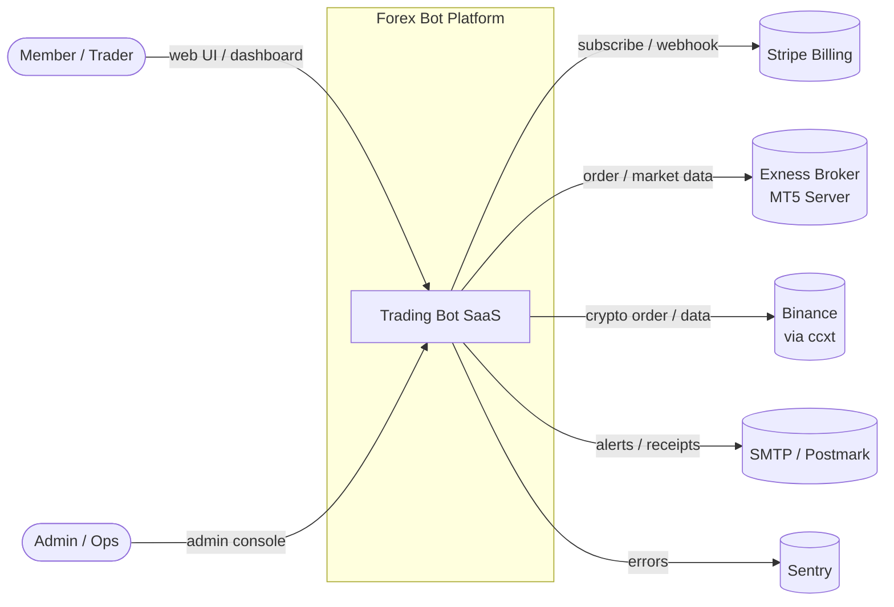
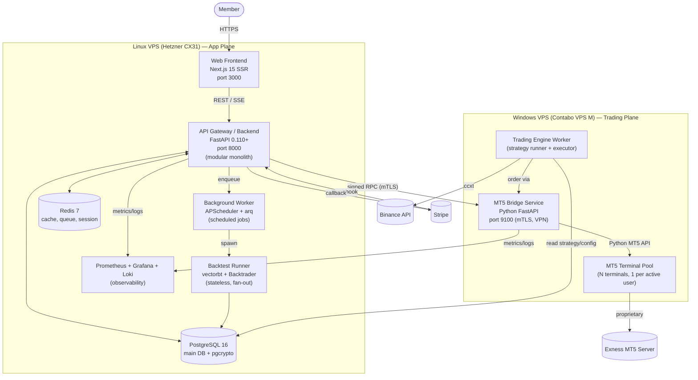
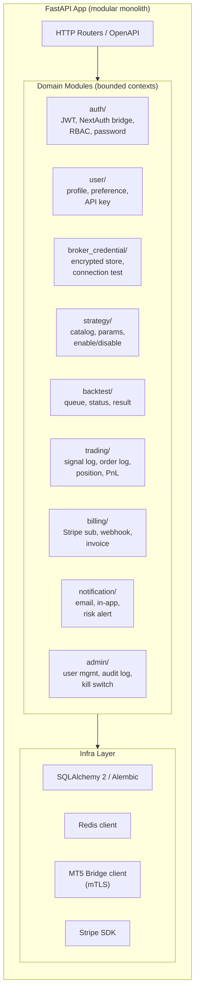
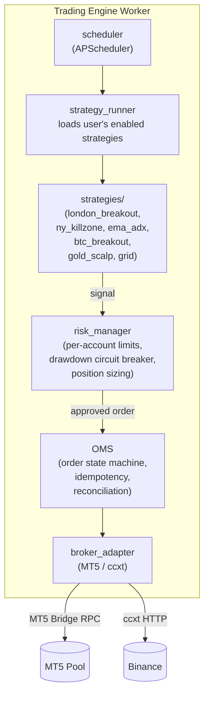
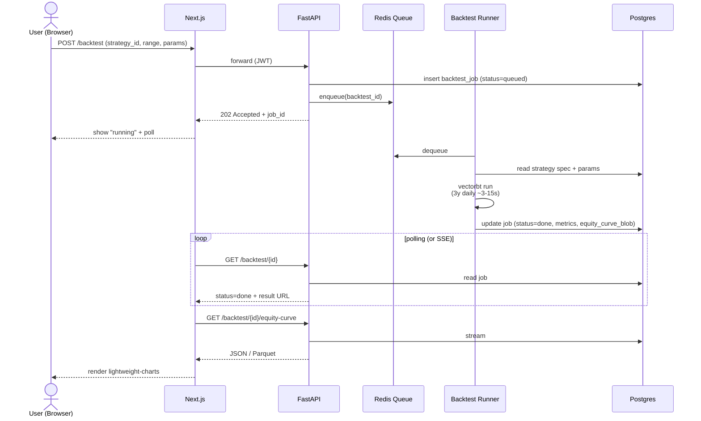
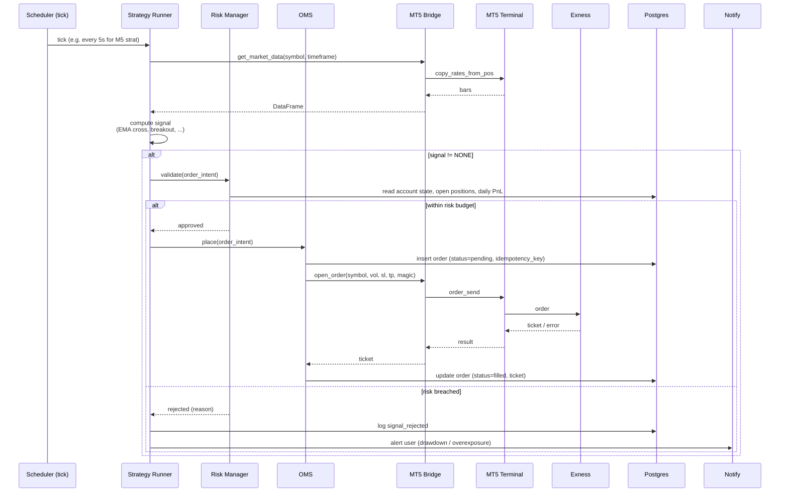
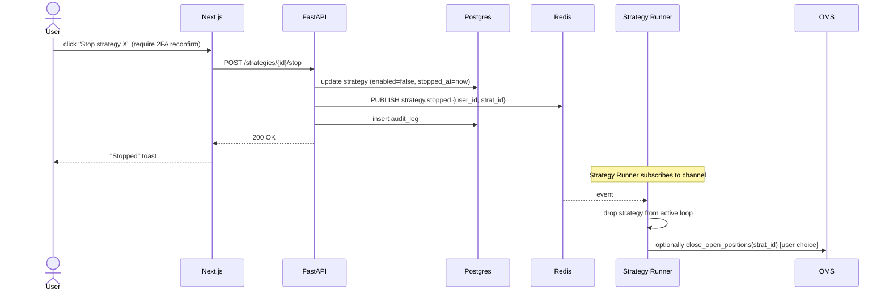

# System Architecture — Forex/Crypto Trading Bot Platform

> Architect: Daedalus Souta
> Version: 1.0
> Status: Draft (Phase 1 — Foundation)
> Last updated: 2026-06-14

---

## 1. Executive Summary

SaaS platform ที่ให้ paid members เชื่อม Exness MT5 account ของตัวเอง และเปิด/ปิด 6 automated strategies (Gold + BTC) ผ่าน UI ที่ใช้งานง่าย พร้อม backtest, live monitoring, billing

**Style:** Modular monolith (FastAPI) + dedicated Trading Engine workers + headless MT5 terminal pool on Windows VPS
**Trade-off ที่กำหนด architecture นี้:**
- 1 team, <50 active users (Phase 1–2) → monolith ก่อน, split later (ADR-006)
- MT5 Python = Windows-only → ต้องมี Windows VPS แยกต่างหาก (ADR-001)
- Boring tech wins → choose proven stack (ADR-003)

---

## 2. C4 Model

### 2.1 C1 — System Context

ใครคุยกับระบบเราบ้าง?



**Actors:**
- **Member** — paid subscriber, เชื่อม MT5 ของตัวเอง, เลือก strategy, ดู PnL
- **Admin** — ops team, ดู system health, จัดการ user, refund
- **Exness MT5** — broker server (login/server/password); access ผ่าน MT5 terminal บน Windows
- **Binance** — crypto exchange; access ผ่าน ccxt + API key ของ user
- **Stripe** — subscription billing; webhook back to us
- **Email** — transactional (welcome, receipt, risk alert)
- **Sentry** — error tracking

---

### 2.2 C2 — Container Diagram



**Container responsibilities:**

| Container | Responsibility | Why separate |
|-----------|---------------|--------------|
| **Web (Next.js)** | UI, SSR, auth UI, SEO | Frontend stack independent of Python |
| **API (FastAPI)** | Public REST API, auth, billing, user/strategy CRUD, orchestration | Single entrypoint, modular monolith |
| **Background Worker** | scheduled jobs (rebalance, daily report, billing reconciliation) | offload long tasks from API |
| **Backtest Runner** | CPU-heavy backtest, isolated process | don't block API; fan-out parallel |
| **MT5 Bridge** | wrap `MetaTrader5` package; expose RPC; manage terminal pool | Windows-only; isolate from app |
| **Trading Engine Worker** | live strategy execution loop | latency-critical; runs near MT5 Bridge on Windows or Linux+RPC |
| **Postgres** | OLTP — users, strategies, orders, trades, billing | single source of truth |
| **Redis** | cache, rate limit, session token, BullMQ-style queue, last-price ticker cache | low-latency, ephemeral |

---

### 2.3 C3 — Component Diagram (Backend FastAPI Monolith)



**Trading Engine components (Windows VPS):**



---

### 2.4 Deployment Topology

```
┌────────────────────────────────────────────────────────────────┐
│  Internet (HTTPS / WSS)                                        │
└──────────────────┬─────────────────────────────────────────────┘
                   │
        ┌──────────┴──────────┐
        │  Cloudflare         │ TLS termination, WAF, DDoS
        │  (CDN + DNS)        │
        └──────────┬──────────┘
                   │
┌──────────────────┴─────────────────────────────────────────────┐
│  LINUX VPS — Hetzner CX31 ($15/mo, 2vCPU, 8GB, 80GB SSD)       │
│  ┌────────────────────────────────────────────────────────────┐ │
│  │  Caddy (reverse proxy, TLS, gzip)                          │ │
│  └─────┬───────────────────────────────────────┬──────────────┘ │
│        │                                       │                │
│  ┌─────┴────┐ ┌─────────┐ ┌────────┐ ┌──────┴─────┐           │
│  │ Next.js  │ │ FastAPI │ │ Worker │ │ Backtest    │           │
│  │ (PM2/    │ │ (uvicorn│ │ (arq)  │ │ Runner      │           │
│  │  systemd)│ │  4 procs)│ │        │ │ (on demand) │           │
│  └──────────┘ └────┬────┘ └───┬────┘ └─────┬──────┘           │
│                   │           │              │                  │
│              ┌────┴───────────┴──────────────┘                  │
│              ▼                                                  │
│  ┌────────────────┐  ┌──────────────┐  ┌─────────────────┐    │
│  │ PostgreSQL 16  │  │  Redis 7     │  │ Prom+Grafana+Loki│    │
│  │ (data volume)  │  │  (RAM)       │  │  (observability) │    │
│  └────────────────┘  └──────────────┘  └─────────────────┘    │
└─────────────────────────────────┬──────────────────────────────┘
                                  │ WireGuard VPN (private link)
                                  │ + mTLS on app layer
                                  ▼
┌────────────────────────────────────────────────────────────────┐
│  WINDOWS VPS — Contabo VPS M ($20/mo, 6vCPU, 16GB, 400GB)      │
│  ┌────────────────────────────────────────────────────────────┐ │
│  │  MT5 Bridge Service (Python FastAPI on port 9100)          │ │
│  │   - RPC endpoints (open_order, close, get_positions, ...)  │ │
│  │   - terminal pool manager (N=~50 max)                      │ │
│  └─────┬──────────────────────────────────────────────────────┘ │
│        │                                                        │
│  ┌─────┴─────────────────────────────────────────────────────┐ │
│  │  Trading Engine Worker (collocated for latency)           │ │
│  │   - scheduler, strategy_runner, risk_manager, OMS         │ │
│  └─────┬─────────────────────────────────────────────────────┘ │
│        │                                                        │
│  ┌─────┴─────┐ ┌─────────┐ ┌─────────┐  ... up to ~50          │
│  │ MT5 #1    │ │ MT5 #2  │ │ MT5 #3  │   terminals             │
│  │ user_A    │ │ user_B  │ │ user_C  │                         │
│  └─────┬─────┘ └────┬────┘ └────┬────┘                         │
└────────┼────────────┼───────────┼───────────────────────────────┘
         │            │           │   each terminal logs into
         ▼            ▼           ▼   different Exness account
                  Exness MT5 Server (broker)
```

**Notes:**
- Linux VPS หนึ่งตัวพอใน Phase 1–2 (snapshot รายวัน → S3-compatible backup)
- Windows VPS แยก 1 ตัวก่อน, scale ออกเป็น 2+ เมื่อใกล้ 50 active users (sharding by user_id)
- VPN tunnel + mTLS — MT5 Bridge ไม่เคยเปิดสู่ public internet
- Crypto path (ccxt → Binance) ไม่ต้องผ่าน Windows; รันบน Linux โดยตรง

---

## 3. Data Flow

### 3.1 Backtest Run



**SLA:** UI ต้องคืนผล ≤ 30s สำหรับ 3-year window (NFR-3)

---

### 3.2 Live Signal → Order Execution



**SLA:** signal → order acknowledged ≤ 2s (NFR-2)

---

### 3.3 Manual Stop (Kill Switch)



**Latency:** stop takes effect ≤ 5s (cache pub/sub propagation)
**Safety:** kill switch ที่ admin (global stop_all) ไม่ต้อง 2FA

---

## 4. Domain Model (Bounded Contexts)

| Bounded Context | Aggregate | Stewardship |
|-----------------|-----------|-------------|
| **Identity** | User, Session, ApiKey | Atlas / Argus |
| **Broker** | BrokerCredential, ConnectionTest | Argus + Kairos |
| **Strategy Catalog** | Strategy, StrategyVersion, Param | Kairos |
| **Backtest** | BacktestJob, BacktestResult | Kairos |
| **Trading** | StrategyAssignment, Signal, Order, Position, Trade | Kairos + Atlas |
| **Billing** | Subscription, Invoice, Payment | Atlas |
| **Notification** | NotificationPreference, NotificationEvent | Atlas |
| **Admin / Audit** | AuditLog, KillSwitch | Argus |

**Ubiquitous language pitfalls (define explicitly in glossary):**
- **Signal** ≠ **Order** ≠ **Trade** ≠ **Position**
- **Strategy** (catalog template) ≠ **StrategyAssignment** (user enables one)
- **Lot** vs **Volume** — เลือก 1 ชื่อ stick กับมัน

---

## 5. Key Architectural Decisions (ดู ADR เต็ม)

| # | Decision | Rationale |
|---|----------|-----------|
| 001 | MT5 ผ่าน Python package, 1 terminal/user pool บน Windows VPS | ทีมต้องการ central UI; MQL5 EA ไม่รองรับ |
| 002 | Monorepo + pnpm workspaces + uv | 1 team, atomic refactor, simpler CI |
| 003 | Stack: FastAPI + Next.js 15 + Postgres + Redis (full list) | boring, mature, fits team skill |
| 004 | Linux VPS (Hetzner) + Windows VPS (Contabo) | cost-effective, separate failure domain |
| 005 | Broker credential: app-level AES-256-GCM envelope encryption, pgcrypto KV | secrets are the highest blast-radius |
| 006 | Monolith first; consider split at Phase 3 if >50 users or team grows | Conway's Law; YAGNI |

---

## 6. Cross-cutting Concerns

### 6.1 Observability
- **Metrics:** Prometheus scrape from FastAPI (`/metrics`), MT5 Bridge, system_exporter
- **Logs:** structured JSON → Loki; correlation ID ผ่านทุก request/order
- **Traces:** OpenTelemetry SDK in FastAPI; consider Tempo later
- **Dashboards:** Grafana — system, business KPI, per-user PnL summary, error budget

### 6.2 Security (ส่งต่อ Argus เต็ม)
- TLS everywhere (Caddy + mTLS for bridge)
- Argon2id password, JWT short-lived + rotate refresh
- Per-user rate limit, broker credential encrypted, audit log immutable
- 2FA required for: change broker cred, enable real-money strategy, withdraw-equivalent action
- Kill switch ที่ admin level

### 6.3 Failure Modes (ทำก่อน happy path)
| What fails | Detection | Mitigation |
|------------|-----------|------------|
| MT5 terminal crash | health check fail | bridge restart terminal; mark assigned user "paused", alert |
| Windows VPS down | bridge no heartbeat 30s | mark all assigned strategies paused; notify users; spin standby |
| Exness API reject (e.g. requote) | error code in result | OMS retry with backoff (max 3), log signal_rejected |
| Postgres down | health probe | API returns 503; restore from latest snapshot (RPO ≤ 1h) |
| Redis down | catch exception | degrade to direct DB; throttle non-critical features |
| Stripe webhook failure | webhook signature check + retry | idempotent; reconcile via daily job |
| Strategy bug causes runaway orders | risk_manager + per-strategy max orders/day cap | hard stop; alert + auto-disable strategy |
| Drawdown breach | risk_manager monitors PnL | auto-disable strategy at user's set DD limit |

### 6.4 Data
- See `docs/database/schema.md` (Mnemosyne)
- Backups: pg_dump nightly → S3-compat (Backblaze B2); 30-day retention; quarterly restore test

---

## 7. Open Questions (escalate to Zeus)
1. Phase 2 — เปิดให้สมัครจ่ายเงินสูงสุดกี่ users? ใช้ตอบ Windows VPS sizing
2. Refund policy? affects billing module + dispute handling
3. KYC requirement? (กฎหมาย TH สำหรับ trading-related SaaS)
4. ต้อง support broker อื่นนอก Exness ใน Phase 1 ไหม? (affect broker_adapter abstraction urgency)

---

## 8. Glossary
- **MT5** — MetaTrader 5, retail trading platform/API
- **EA** — Expert Advisor (MQL5 script ที่รันใน MT5 terminal)
- **OMS** — Order Management System
- **NFR** — Non-functional Requirement
- **RPO** — Recovery Point Objective (data loss tolerance)
- **RTO** — Recovery Time Objective (downtime tolerance)
- **PF** — Profit Factor (gross profit / gross loss)
- **DD** — Drawdown
- **bounded context** — DDD term, ขอบเขตของ model ที่ consistent
