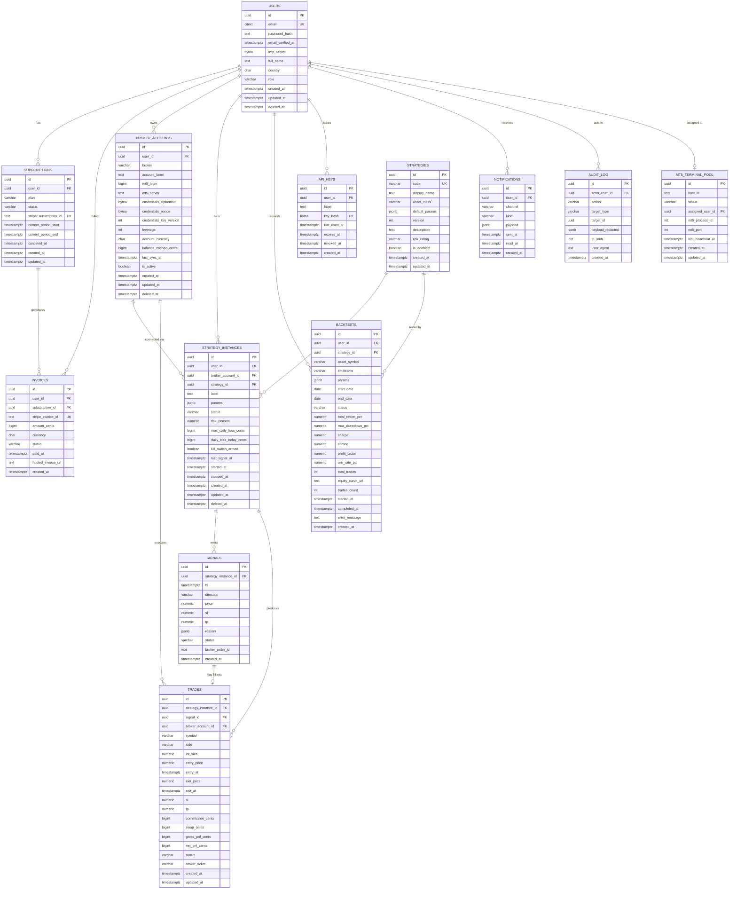
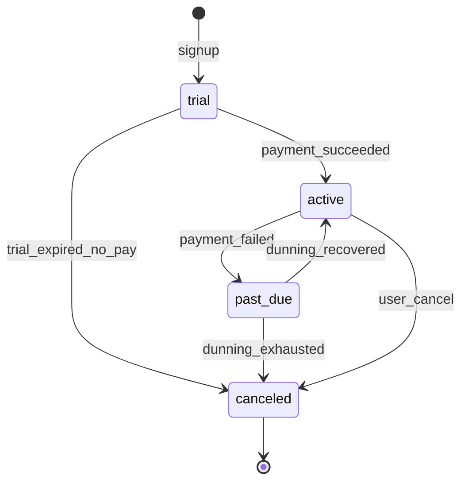
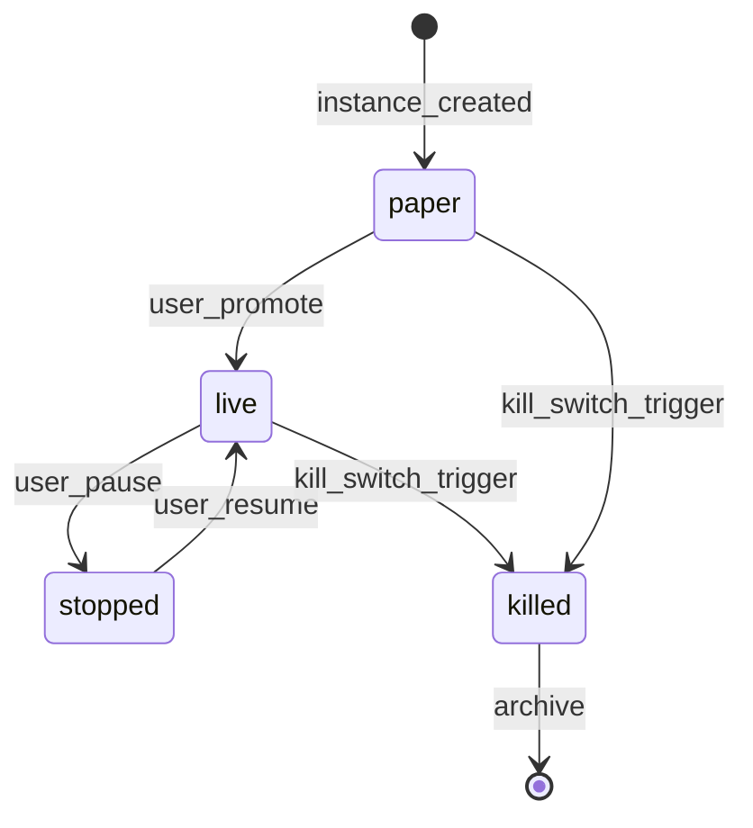

# ER Diagram — Forex/Crypto Trading Bot Platform

> Mermaid ER diagram of the OLTP schema
> **Author:** Mnemosyne Rin
> **Created:** 2026-06-14

---

## Full Diagram

---

## Relationship Notes

- `USERS` is the strong root entity; almost everything traces back to it.
- `STRATEGY_INSTANCES` is the central operational entity: it binds a user × broker × strategy and is the parent of `SIGNALS` and `TRADES`.
- `SIGNALS` -> `TRADES` is 1..0..1 — a signal may not fill; a trade always has a signal except for manual flats (signal_id NULL).
- `MT5_TERMINAL_POOL` -> `USERS` is 1:1 partial (only while assigned), enforced by partial unique index on `assigned_user_id`.
- `AUDIT_LOG.actor_user_id` is `ON DELETE SET NULL` for compliance (we keep history but de-identify on purge).
- `SUBSCRIPTIONS` -> `INVOICES` is 1:N — one subscription can produce many invoices over time.
- `BROKER_ACCOUNTS` -> `TRADES` directly (not transit through strategy instance) because closed positions still belong to the broker account even if the instance is deleted.

---

## Lifecycle Diagram (state)

