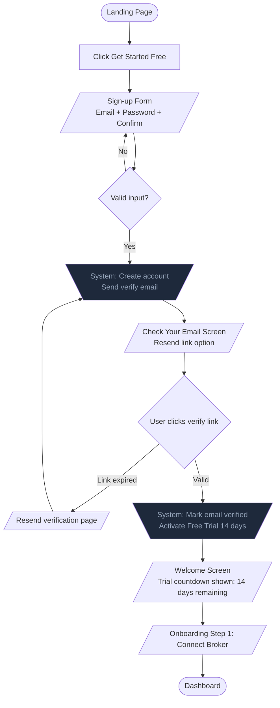
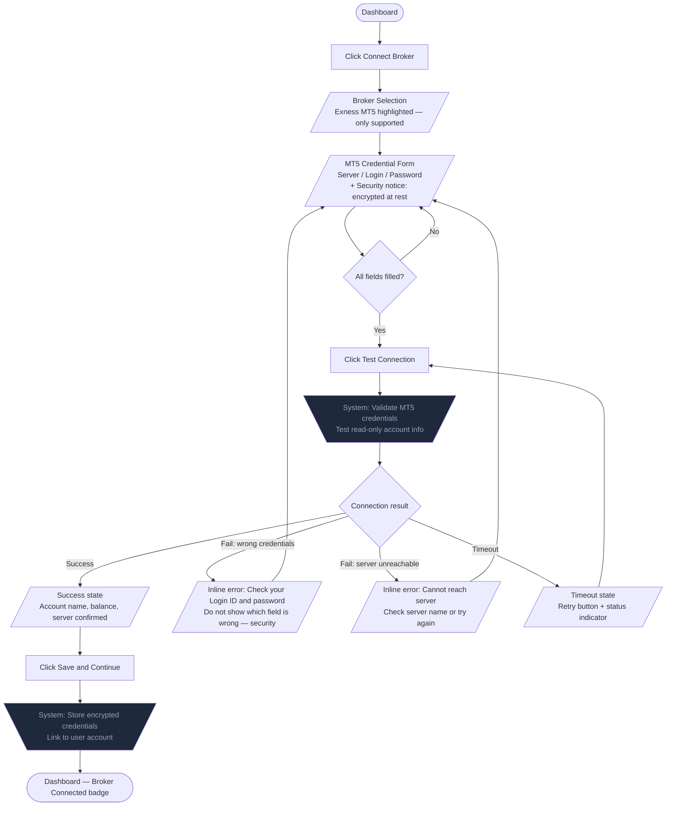
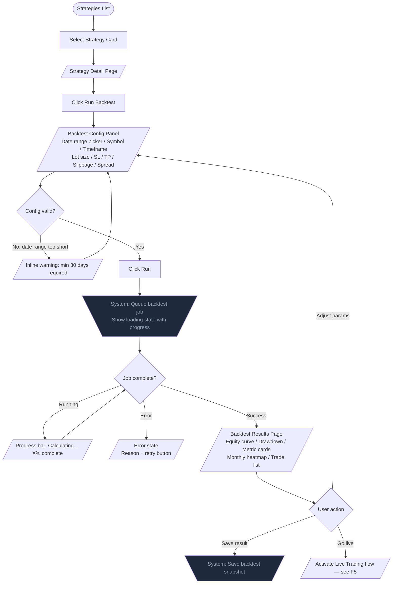
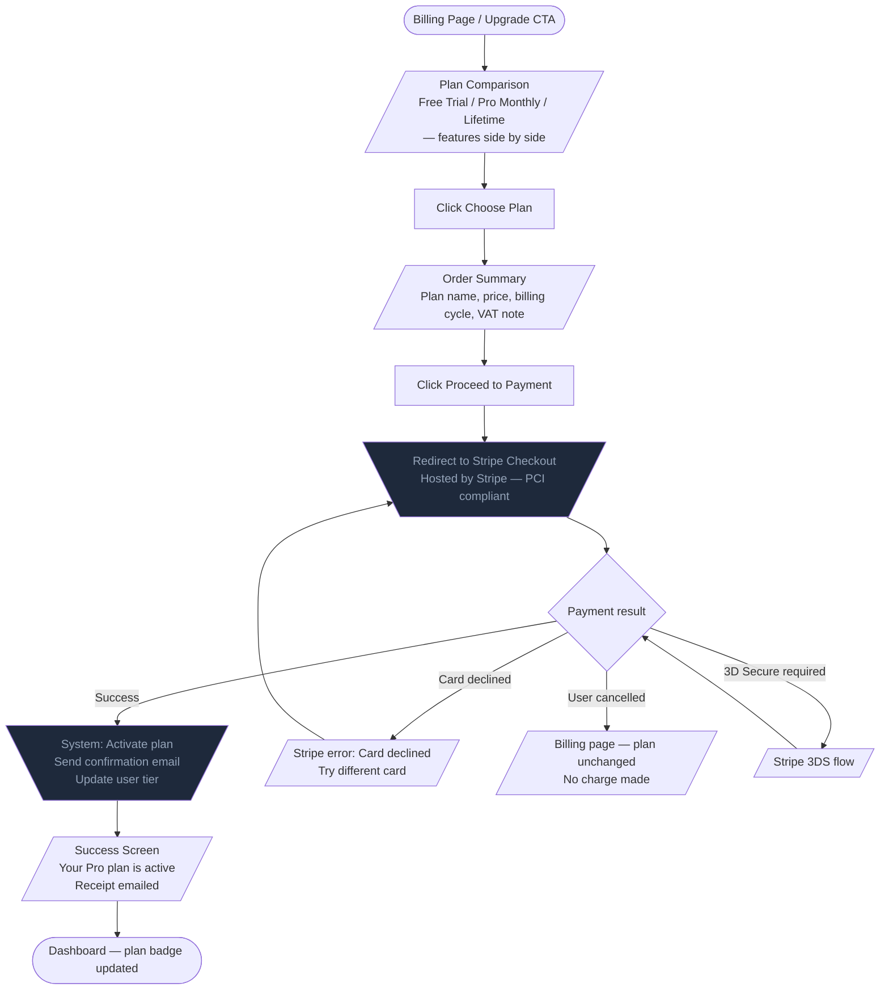
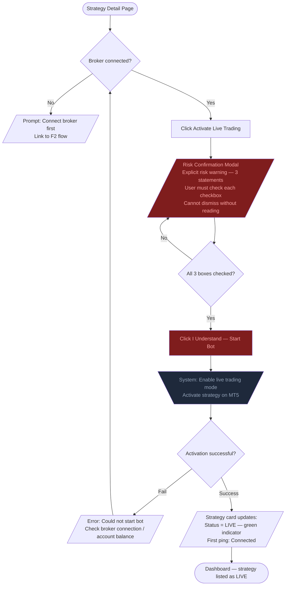
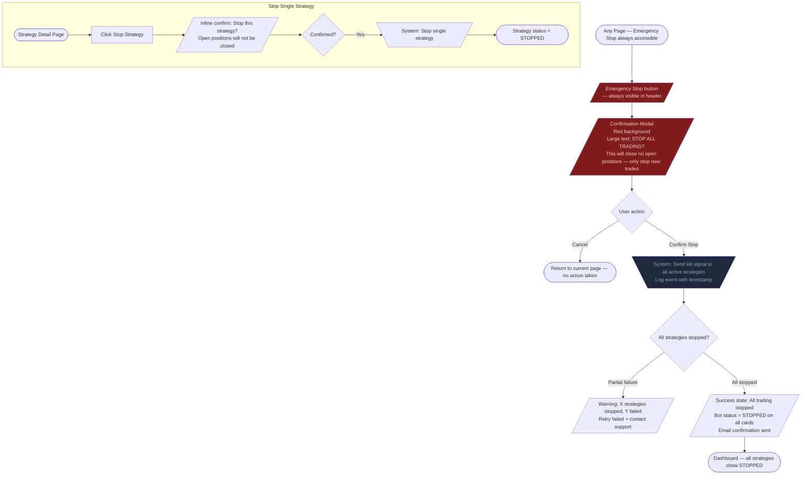

# User Flows — Trading Bot SaaS
**Author:** Iris Kaguya (UX/UI Designer)
**Date:** 2026-06-14
**Project:** Forex/Crypto Trading Bot Platform

Notation:
- Rectangle = screen / page
- Diamond = decision
- Parallelogram = system action
- Bold border = critical / irreversible action

---

## F1: Sign-up → Email Verify → Trial Activation

**Primary persona:** P1 Warit (Beginner)
**Goal:** Get from zero to active Free Trial with bot access in under 5 minutes.

**Edge cases:**
- Email already registered → show "Sign in instead" inline error
- Verify link clicked after 24h → explain expiry, offer one-click resend
- User closes tab after registration → next visit shows "verify your email" banner until confirmed
- Mobile: verify link opens app deeplink, not broken browser redirect

---

## F2: Connect Exness MT5 → Broker Credential Form → Test Connection

**Primary persona:** P1 Warit, P2 Priya
**Goal:** Securely connect MT5 account so bot can execute trades.

**Edge cases:**
- User pastes password with trailing space → trim silently but note in tooltip "spaces removed"
- MT5 server list: provide dropdown with known Exness servers as autocomplete
- Connection success but read-only (wrong account type) → warn clearly before saving
- Credentials update: require password re-entry to modify saved broker credentials

---

## F3: Run Backtest → Pick Strategy → Set Params → See Equity Curve

**Primary persona:** P2 Priya, P3 Krit
**Goal:** Validate strategy performance on historical data before going live.

**Edge cases:**
- Backtest on insufficient data (e.g., strategy needs 200 candles, range gives 50) → block with explanation
- Long-running backtest (>60s) → show progress bar, allow leaving page (notified when done)
- Results with zero trades → explain why (strategy conditions never triggered) with parameter suggestions
- P3 Krit: export button always visible — CSV/JSON of full trade log

---

## F4: Subscribe to Plan → Stripe Checkout → Activate

**Primary persona:** P1 Warit (upgrade), P2 Priya (upgrade/change)
**Goal:** Upgrade from Free Trial to paid plan with minimal friction.

**Edge cases:**
- Trial expiry mid-session → show non-blocking banner "Trial ends in X days — upgrade to keep access"
- Lifetime plan: one-time charge, no auto-renew — copy must be explicit
- VAT/tax for Thai users: Stripe Tax handles calculation — display before confirm
- Downgrade: handled by cancellation at end of billing period, not immediate

---

## F5: Activate Live Trading → Confirm Risk Warning → Bot Running

**Primary persona:** P1 Warit, P2 Priya
**Goal:** Start the bot on a live account after understanding the risks.

**Risk warning modal content (non-negotiable):**
1. "Automated trading involves risk of financial loss. Past performance does not guarantee future results."
2. "This bot will place real trades on your Exness account using real money."
3. "You are responsible for monitoring your account and setting appropriate position sizes."

**Edge cases:**
- Account balance too low for minimum lot → warn before activation, not after
- Strategy already running on another account → prevent duplicate activation, explain why
- Trial user trying to activate live → gate with upgrade prompt
- MT5 account in read-only mode → detect and block with clear error before showing risk modal

---

## F6: Manual Stop / Emergency Kill Switch

**Primary persona:** P1 Warit (panic), P2 Priya (planned), P3 Krit (programmatic)
**Goal:** Stop all bot activity immediately. Zero ambiguity. Zero delay.

**Critical design decisions:**
- Emergency stop is in the persistent header — always visible, never hidden behind a menu
- Confirmation modal is the ONLY gate — no second confirmation, no timeout, no password
- Stop does NOT close open positions by default — this is disclosed in the modal explicitly
- System logs the stop event with user ID, timestamp, and all stopped strategy IDs
- Email confirmation of stop event sent immediately
- Keyboard shortcut: modal is focusable, Enter = Cancel (safe default), Tab to Confirm then Enter

**Edge cases:**
- Network loss during kill → system must have last-known-state; resync on reconnect shows correct STOPPED status
- User refreshes immediately after stop → status persists from server, not local state
- Stop while backtest running → backtest cancels, data is discarded — explain in modal
